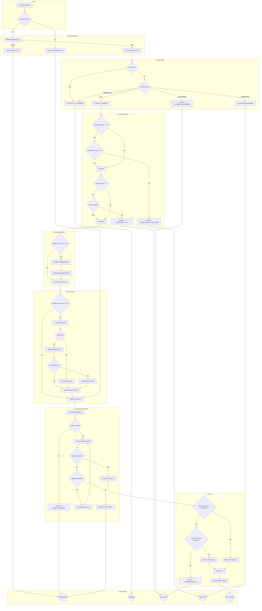

# SPIRAL Resolver Routing Flow v1.0

**Status:** Draft  
**Last Updated:** 2025-01-01  
**License:** CC BY 4.0

---

## 1. Overview

This document specifies the complete routing decision flow for SPIRAL packets, integrating:
- RPP Canonical Address resolution
- Consent Packet Header validation
- Phase Memory Anchor (PMA) linkage
- Fallback vector activation
- Complecount validation

---

## 2. High-Level Flow Diagram



---

## 3. Detailed Step Specifications

### Step 1: Packet Reception

```python
def receive_packet(raw_bytes: bytes) -> RoutingResult:
    """Entry point for packet routing."""
    
    # Determine packet type by size
    if len(raw_bytes) < 4:
        return RoutingResult(status=REJECT, reason="PACKET_TOO_SHORT")
    
    if len(raw_bytes) == 4:
        # RPP Compact (address only)
        return route_compact(raw_bytes)
    
    if len(raw_bytes) >= 18:
        # May have Consent Header
        return route_with_header(raw_bytes)
    
    # RPP Extended (address + payload, no header)
    return route_extended(raw_bytes)
```

### Step 2: Header Validation

```python
def validate_header(header_bytes: bytes) -> ValidationResult:
    """Validate Consent Packet Header structure and CRC."""
    
    if len(header_bytes) < 18:
        return ValidationResult(valid=False, reason="HEADER_TOO_SHORT")
    
    # Extract and verify CRC
    stored_crc = header_bytes[17]
    computed_crc = compute_header_crc(header_bytes[:17])
    
    if stored_crc != computed_crc:
        return ValidationResult(valid=False, reason="CRC_MISMATCH")
    
    # Parse header fields
    header = ConsentPacketHeader.from_bytes(header_bytes)
    
    # Validate RPP address
    if not header.rpp_address.is_valid():
        return ValidationResult(valid=False, reason="INVALID_RPP_ADDRESS")
    
    return ValidationResult(valid=True, header=header)
```

### Step 3: Consent Gate

```python
def consent_gate(header: ConsentPacketHeader, context: RoutingContext) -> GateResult:
    """Evaluate consent state and ETF status."""
    
    # Check global ETF
    if context.etf_active:
        return GateResult(action=FREEZE, reason="ETF_OVERRIDE")
    
    # Derive consent state from header fields
    consent_state = derive_consent_state(header)
    
    match consent_state:
        case ConsentState.EMERGENCY_OVERRIDE:
            return GateResult(action=FREEZE, reason="EMERGENCY_OVERRIDE")
        
        case ConsentState.SUSPENDED:
            return GateResult(action=BLOCK, reason="CONSENT_SUSPENDED")
        
        case ConsentState.DIMINISHED:
            return GateResult(action=DELAY, reason="RECONFIRMATION_REQUIRED")
        
        case ConsentState.FULL:
            return GateResult(action=CONTINUE)

def derive_consent_state(header: ConsentPacketHeader) -> ConsentState:
    """Derive ACSP consent state from header fields."""
    
    consent_somatic = header.consent_somatic  # 0.0-1.0
    consent_verbal = header.consent_verbal    # bool
    
    if consent_somatic < 0.2:
        return ConsentState.SUSPENDED
    elif consent_somatic < 0.5 and not consent_verbal:
        return ConsentState.DIMINISHED
    else:
        return ConsentState.FULL
```

### Step 4: Consent Validation

```python
def validate_consent_fields(header: ConsentPacketHeader) -> ValidationResult:
    """Validate consent field relationships."""
    
    # Rule C1: Low somatic consent requires complecount
    if header.consent_somatic < 0.3:
        if header.complecount_trace == 0:
            return ValidationResult(
                valid=False, 
                reason="COMPLECOUNT_REQUIRED",
                action=DELAY
            )
    
    # Rule C3: Temporal lock enforcement
    if header.temporal_lock:
        if not context.phase_shifted_since(header.packet_id):
            return ValidationResult(
                valid=False,
                reason="TEMPORAL_LOCK_ACTIVE",
                action=BLOCK
            )
    
    return ValidationResult(valid=True)
```

### Step 5: Entropy & Fallback

```python
def evaluate_entropy(header: ConsentPacketHeader) -> EntropyResult:
    """Check phase entropy and activate fallback if needed."""
    
    ENTROPY_THRESHOLD = 25
    
    if header.phase_entropy_index > ENTROPY_THRESHOLD:
        # Compute fallback address
        fallback_addr = compute_fallback(
            header.rpp_address, 
            header.fallback_vector
        )
        return EntropyResult(
            use_fallback=True,
            primary=header.rpp_address,
            fallback=fallback_addr
        )
    
    return EntropyResult(
        use_fallback=False,
        primary=header.rpp_address
    )
```

### Step 6: PMA Linkage

```python
def link_to_pma(header: ConsentPacketHeader) -> PMAResult:
    """Link packet to Phase Memory Anchor if specified."""
    
    window_id = header.coherence_window_id
    
    if window_id == 0:
        # Stateless packet
        return PMAResult(linked=False)
    
    if window_id == 0xFFFF:
        # Allocate new PMA
        new_id = allocate_pma(header.origin_avatar_ref)
        anchor_packet(new_id, header)
        return PMAResult(linked=True, window_id=new_id, allocated=True)
    
    # Load existing PMA
    pma = load_pma(window_id)
    
    if pma is None or pma.state == PMAState.DISSOLVED:
        # PMA doesn't exist or is invalid
        new_id = allocate_pma(header.origin_avatar_ref)
        anchor_packet(new_id, header)
        return PMAResult(linked=True, window_id=new_id, allocated=True)
    
    # Validate packet against PMA context
    coherence_ok = validate_pma_coherence(pma, header)
    
    if not coherence_ok:
        log_pma_drift(window_id, header)
    
    # Anchor packet regardless (update PMA)
    anchor_packet(window_id, header)
    
    return PMAResult(
        linked=True, 
        window_id=window_id,
        coherence_ok=coherence_ok
    )
```

### Step 7: Address Resolution

```python
def resolve_address(
    address: RPPCanonicalAddress, 
    fallback: RPPCanonicalAddress | None,
    context: RoutingContext
) -> ResolutionResult:
    """Resolve RPP address to fragment(s)."""
    
    # Validate address
    if not address.is_valid():
        return ResolutionResult(status=REJECT, reason="INVALID_ADDRESS")
    
    # Query fragment mesh
    candidates = context.fragment_mesh.query(
        theta=address.theta,
        phi=address.phi,
        harmonic=address.harmonic,
        radius_tolerance=0.1
    )
    
    if not candidates:
        # Try fallback if available
        if fallback:
            return resolve_address(fallback, None, context)
        return ResolutionResult(status=REJECT, reason="NO_ROUTE")
    
    # Rank by coherence
    ranked = rank_by_coherence(candidates, address, context)
    
    return ResolutionResult(
        status=RESOLVED,
        candidates=ranked
    )
```

### Step 8: Delivery

```python
def deliver_packet(
    packet: Packet,
    candidates: list[RankedFragment],
    context: RoutingContext
) -> DeliveryResult:
    """Deliver packet to best matching fragment."""
    
    best = candidates[0]
    
    # Coherence threshold check
    COHERENCE_THRESHOLD = 0.6
    
    if best.coherence_score < COHERENCE_THRESHOLD:
        if context.coherence_check_enabled:
            return DeliveryResult(status=BLOCK, reason="COHERENCE_FAIL")
        else:
            # Deliver with warning
            log_low_coherence(packet, best)
    
    # Deliver to fragment
    result = best.fragment.receive(packet)
    
    # Audit log
    log_to_scl(packet, best, result)
    
    return DeliveryResult(status=DELIVERED, fragment=best.fragment)
```

---

## 4. State Transition Summary

| Input State | Condition | Output State | Action |
|-------------|-----------|--------------|--------|
| RECEIVED | No header, valid address | RESOLVED | Route compact |
| RECEIVED | Header CRC fail | REJECTED | Drop packet |
| VALIDATED | ETF active | FROZEN | Halt all |
| VALIDATED | Consent = SUSPENDED | BLOCKED | Quarantine |
| VALIDATED | Consent = DIMINISHED | DELAYED | Queue + reconfirm |
| CONSENT_OK | somatic < 0.3, complecount = 0 | DELAYED | Request complecount |
| CONSENT_OK | temporal_lock, no phase shift | BLOCKED | Wait for shift |
| VALIDATED | entropy > 25 | FALLBACK | Use alternate route |
| RESOLVED | No fragments | REJECTED | No route |
| RESOLVED | Coherence < threshold, check enabled | BLOCKED | Coherence fail |
| RESOLVED | Coherence OK | DELIVERED | Success |

---

## 5. Error Codes

| Code | Name | Description | Recovery |
|------|------|-------------|----------|
| E001 | CRC_FAIL | Header CRC mismatch | Resend packet |
| E002 | INVALID_ADDRESS | RPP address out of range | Check encoding |
| E003 | ETF_OVERRIDE | Emergency Token Freeze active | Wait for clearance |
| E004 | CONSENT_SUSPENDED | User consent suspended | Await consent change |
| E005 | COMPLECOUNT_REQUIRED | Low somatic needs complecount | Add non-event trace |
| E006 | TEMPORAL_LOCK | Routing blocked until phase shift | Wait for phase shift |
| E007 | NO_ROUTE | No fragments match address | Check address or retry |
| E008 | COHERENCE_FAIL | Coherence below threshold | Adjust address or disable check |
| E009 | PMA_INVALID | Referenced PMA doesn't exist | Use window_id=0xFFFF to allocate |
| E010 | PMA_DRIFT | Packet deviates from PMA context | Log and continue |

---

## 6. Performance Targets

| Metric | Target | Notes |
|--------|--------|-------|
| Header validation | < 1μs | CRC + field extraction |
| Consent gate | < 5μs | State lookup + ETF check |
| PMA lookup | < 10ms | Database query |
| Fragment query | < 20ms | Mesh search |
| Total routing (p50) | < 30ms | End-to-end |
| Total routing (p99) | < 100ms | Including retries |

---

## 7. Implementation Checklist

- [ ] Header CRC validation (CRC-8/CCITT)
- [ ] Consent state derivation from header fields
- [ ] ETF status integration with HNC
- [ ] Complecount validation rule (C1)
- [ ] Temporal lock enforcement
- [ ] Entropy threshold check (> 25)
- [ ] Fallback vector computation (XOR-based)
- [ ] PMA allocation and anchoring
- [ ] PMA coherence validation
- [ ] Fragment mesh query interface
- [ ] Coherence ranking algorithm
- [ ] SCL audit logging
- [ ] Error code propagation

---

## 8. Version History

| Version | Date | Changes |
|---------|------|---------|
| 1.0.0 | 2025-01-01 | Initial routing flow specification |

---

*"Route by resonance, not just destination."*
